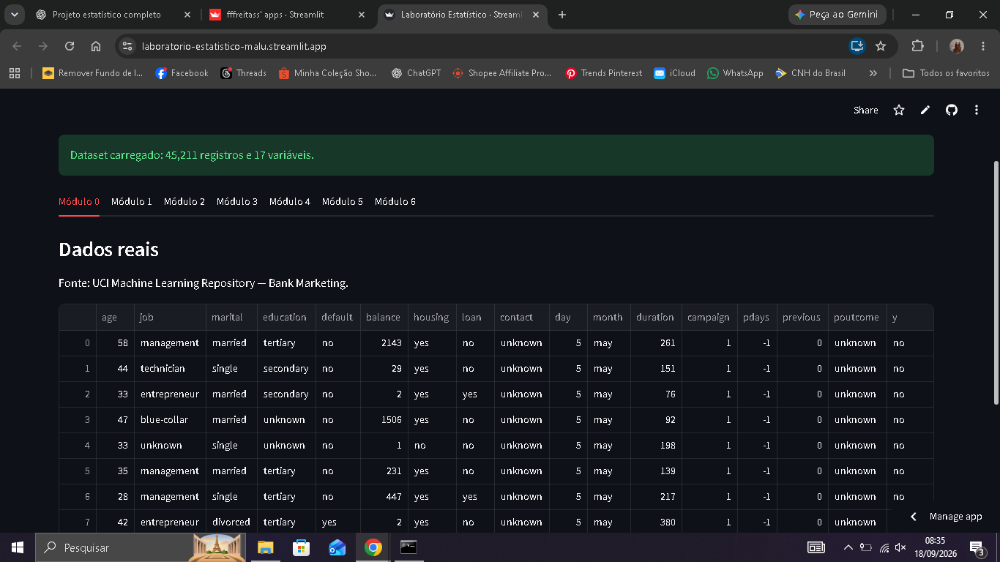
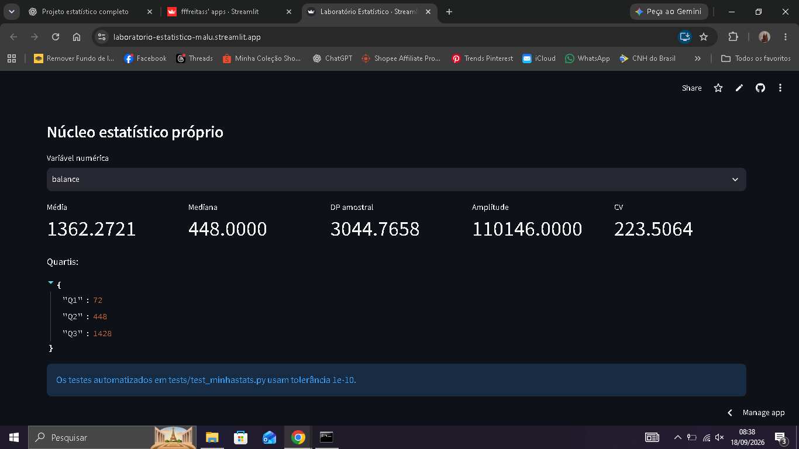
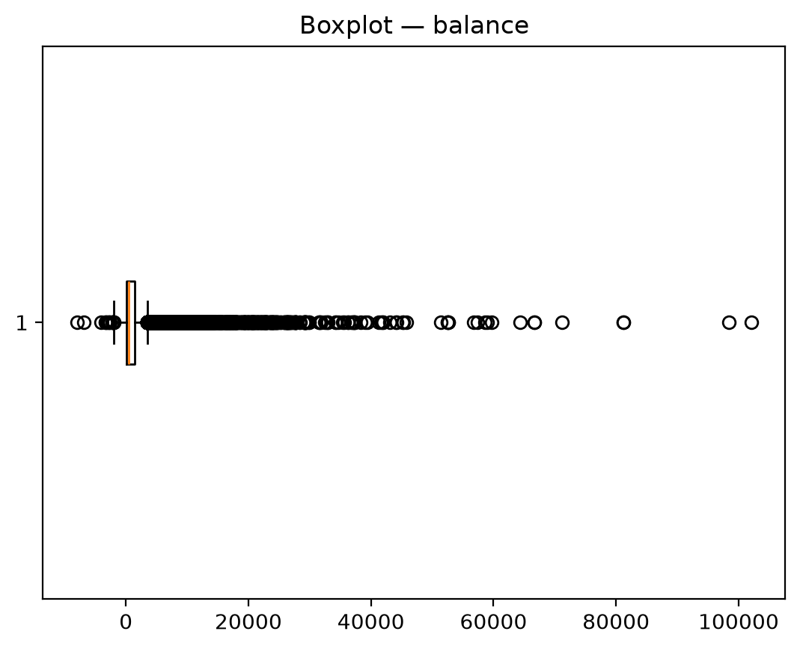
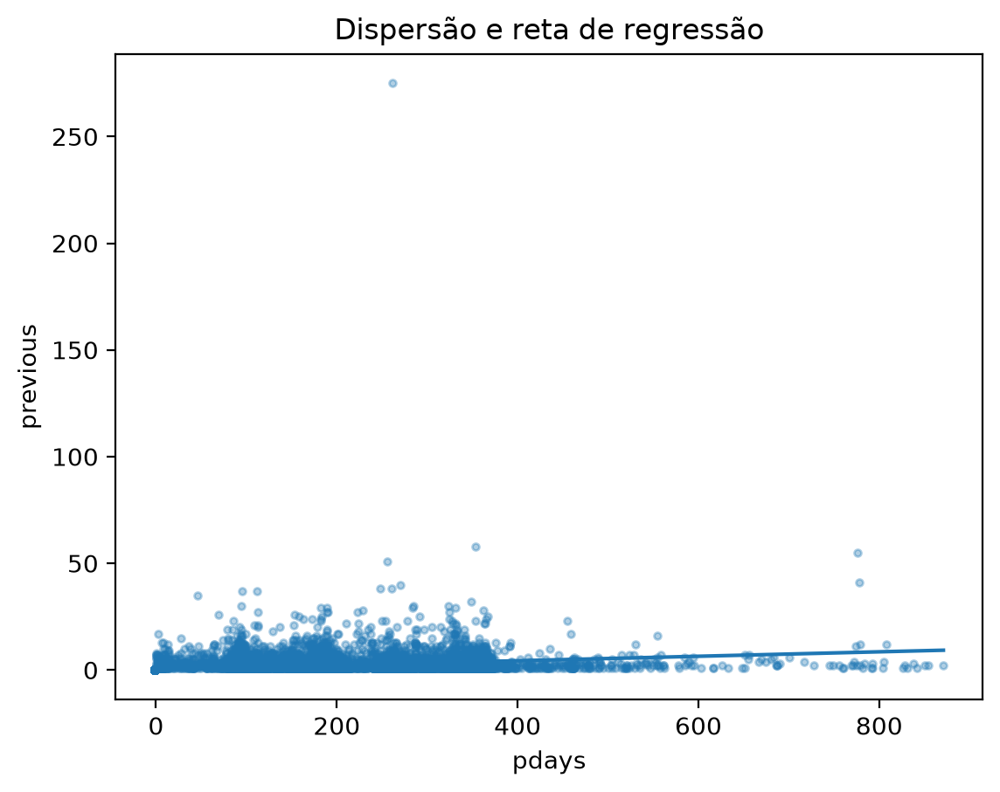
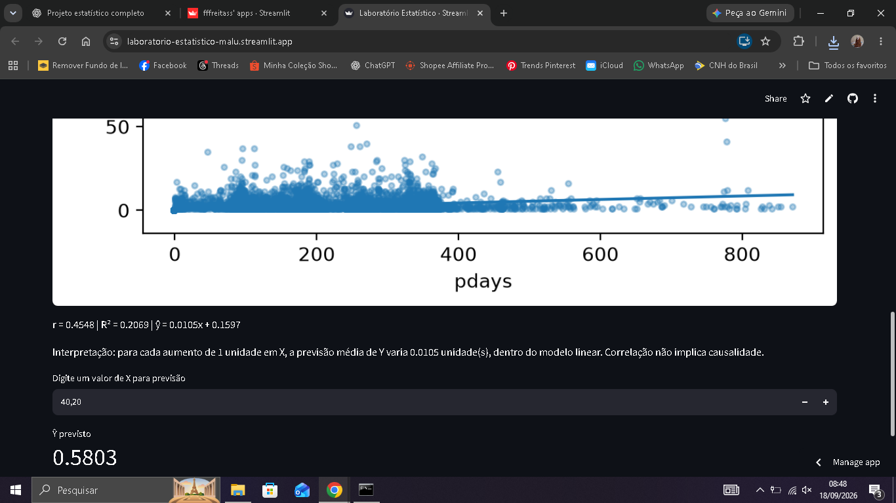

# RELATÓRIO — Laboratório Estatístico Interativo

## 1. Identificação
**Estudante:** Maria Luiza de Freitas Viana  
**Matrícula:** 72650012  
**Grupo:** Individual

## 2. Dataset e justificativa
Foi escolhido o dataset **Bank Marketing**, disponibilizado pelo UCI Machine Learning Repository. O conjunto possui 45.211 registros e 17 variáveis na versão bank-full.csv, incluindo variáveis numéricas e categóricas suficientes para os requisitos do projeto.

Fonte original: https://archive.ics.uci.edu/dataset/222/bank%2Bmarketing

A temática permite analisar características dos clientes e resultados de campanhas de marketing bancário, além de oferecer variáveis adequadas para estatística descritiva, simulação, distribuição, correlação e regressão.

## 3. Núcleo estatístico próprio
As medidas exibidas pela aplicação são calculadas em src/minhastats.py.

### Média
x̄ = (1/n) Σ xi

### Mediana
Os valores são ordenados. Para quantidade ímpar, usa-se o elemento central; para quantidade par, calcula-se a média dos dois elementos centrais.

### Moda
É identificada por contagem das ocorrências de cada valor.

### Amplitude
A = xmax − xmin

### Variância
Populacional:
σ² = Σ(xi − μ)² / n

Amostral:
s² = Σ(xi − x̄)² / (n − 1)

### Desvio padrão
É a raiz quadrada da variância.

### Percentis e quartis
Foi implementada interpolação linear sobre os valores ordenados. Q1, Q2 e Q3 correspondem aos percentis 25, 50 e 75.

### Coeficiente de variação
CV = (s / |x̄|) × 100

### Covariância
Cov(X,Y) = Σ[(xi − x̄)(yi − ȳ)] / (n − 1)

### Correlação de Pearson
r = Σ[(xi − x̄)(yi − ȳ)] / √[Σ(xi − x̄)² Σ(yi − ȳ)²]

### Regressão linear
A inclinação foi obtida por:
a = Σ[(xi − x̄)(yi − ȳ)] / Σ(xi − x̄)²

e o intercepto por:
b = ȳ − ax̄

A previsão é ŷ = ax + b.

## 4. Validação
Os testes automatizados estão em tests/test_minhastats.py. As funções próprias são comparadas com NumPy e SciPy, utilizando tolerância numérica de 1e-10.

São testados média, mediana, moda, variâncias populacional e amostral, desvio padrão, percentis, covariância, correlação e regressão.

## 5. Módulo 2 — Estatística descritiva
Para variáveis numéricas, a aplicação apresenta tabela de frequências por classes, medidas de tendência central e dispersão, histograma e boxplot. Os possíveis outliers são identificados pela regra:

IQR = Q3 − Q1

Limite inferior = Q1 − 1,5 IQR

Limite superior = Q3 + 1,5 IQR

Para variáveis categóricas, são apresentadas frequências, percentuais e gráficos de barras; quando há poucas categorias, também é exibido gráfico de pizza.

## 6. Módulo 3 — Probabilidade e simulação
A Lei dos Grandes Números é demonstrada por lançamentos simulados de uma moeda, acompanhando a frequência relativa de caras e sua aproximação de 0,5.

O Teorema Central do Limite é demonstrado por amostras aleatórias repetidas de uma variável numérica do dataset. O usuário controla o número de repetições e o tamanho da amostra, e a aplicação apresenta o histograma das médias amostrais.

## 7. Módulo 4 — Distribuições teóricas
A aplicação permite comparar o histograma de uma variável numérica com uma Normal, usando média e desvio padrão estimados dos dados, ou com uma Poisson, usando λ igual à média.

A comparação é interpretada visualmente e não é apresentada como teste formal de aderência.

## 8. Módulo 5 — Correlação e regressão
O usuário escolhe duas variáveis numéricas. A aplicação apresenta o diagrama de dispersão, correlação de Pearson, reta de mínimos quadrados, equação, R² e uma caixa para previsão.

A interpretação é feita no contexto do modelo linear. É destacado que correlação não implica causalidade.

## 9. Módulo 6 — Descobertas

A partir das análises realizadas no laboratório, foram selecionadas três descobertas estatísticas principais.

### Descoberta 1 — Distribuição da variável `balance`

A variável `balance`, que representa o saldo dos clientes, apresentou média de **1362,27** e mediana de **448,00**. O desvio-padrão amostral foi de **3044,77** e o coeficiente de variação foi de aproximadamente **223,51%**.

A diferença considerável entre a média e a mediana, juntamente com a elevada dispersão dos dados e os valores extremos observados nos gráficos, indica uma distribuição com forte assimetria à direita. Isso mostra que existem clientes com saldos muito elevados que aumentam a média da variável.

### Descoberta 2 — Associação entre `pdays` e `previous`

Ao analisar as variáveis `pdays` e `previous`, foi obtido um coeficiente de correlação de Pearson de aproximadamente **r = 0,4548** e um coeficiente de determinação de **R² = 0,2069**.

Esses resultados indicam uma associação linear positiva moderada entre as duas variáveis no conjunto analisado. O valor de R² indica que aproximadamente **20,69% da variação observada em `previous` pode ser explicada pelo modelo linear utilizando `pdays`**, dentro das limitações desse modelo.

É importante destacar que a existência de correlação entre as variáveis não significa que exista uma relação de causa e efeito entre elas.

### Descoberta 3 — Teorema Central do Limite

Na simulação do Teorema Central do Limite foi utilizada a variável `age`, com amostras de tamanho **n = 30** retiradas repetidamente do conjunto de dados.

Foi possível observar que as médias obtidas nas diferentes amostras se concentraram ao redor da média populacional e apresentaram uma distribuição aproximadamente normal. Esse comportamento ilustra o Teorema Central do Limite e mostra como a distribuição das médias amostrais tende a assumir formato aproximadamente normal conforme são realizadas amostragens repetidas.

## 10. Conclusão
O laboratório reúne os principais conceitos estatísticos solicitados na atividade em uma aplicação interativa. A separação entre o núcleo estatístico próprio e a interface permite verificar que as medidas apresentadas ao usuário não dependem diretamente das funções estatísticas prontas das bibliotecas de referência.

## 11. Evidências
As capturas a seguir registram a execução da aplicação e apresentam evidências dos principais resultados utilizados nas análises deste relatório.

### Evidência 1 — Dataset utilizado

A aplicação carregou corretamente o conjunto Bank Marketing, contendo 45.211 registros e 17 variáveis.

### Evidência 2 — Estatística descritiva da variável `balance`

A análise da variável `balance` apresentou média de 1362,2721, mediana de 448,0000, desvio-padrão amostral de 3044,7658 e coeficiente de variação de aproximadamente 223,51%.

### Evidência 3 — Distribuição e outliers de `balance`

O histograma e o boxplot permitem observar a forte assimetria à direita da variável e a presença de diversos valores extremos.

### Evidência 4 — Teorema Central do Limite

A simulação foi realizada utilizando a variável `age`, com 2.000 repetições e amostras de tamanho 30. A distribuição das médias amostrais apresentou formato aproximadamente normal e concentração em torno da média da variável.

### Evidência 5 — Correlação e regressão

Na análise entre `pdays` e `previous`, foi obtido coeficiente de correlação de Pearson de aproximadamente 0,4548 e R² de aproximadamente 0,2069, evidenciando associação linear positiva entre as variáveis.

